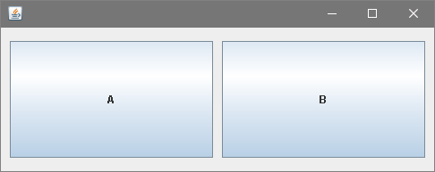
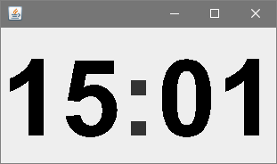
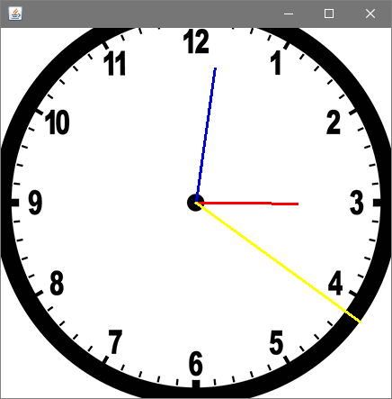

# PUC-INF1013
Modelagem de Software

# About
O foco do trabalho era implementar corretamente as técnicas de design pattern e programação vistas durante o curso.  
[Enunciado](https://github.com/thiagola92/PUC-INF1013-Relogio/blob/master/1121561/RelogioDigital.pdf)  
**Obs**: Parte do conteúdo está obsoleto em java, por exemplo a classe *Observable*.  

Ao executar, você será apresentado a 3 janelas no canto superior esquerdo do seu monitor, tire uma da frente da outra para melhor visualização.  
1. Janela dos botões
2. Relógio digital
3. Relógio analógico

Ambos relógios devem sempre apresentar a mesma hora e minuto pois eles estão ligados ao mesmo objeto responsável pela hora.  

1) Janela dos botões  
  
São utilizados para manipular os estados dos relógios (descansando, mudando hora e mudando minuto)  
A ordem dos estados é justamente descansando, mudando hora e mudando minuto  

Botão A tem duas interações:  
* Clicar no botão A == apertar o botão A e soltar botão A == Muda o estado do relógio
* Segurar o botão A == apertar o botão A, retirar o mouse de cima do botão A e soltar o botão A == Sinaliza que você está alterando esse estado

Para sair do "Segurar o botão A" basta passar o mouse em cima do botão A novamente.  

Botão B apenas tem uma interação e só ocorre se o botão A estiver sendo **segurado**:  
* Adicionar 1 ao estado que você está alterando.  

Botão B

2) Relógio digital  
  
A imagem exibe o relógio no estado *descansando*.  
Caso os números que representem a hora estejam vermelhos, se encontra no estado *mudando hora*  
Caso os números que representem a minuto estejam vermelhos, se encontra no estado *mudando minuto*  

3) Relógio analógico  
  
Esse relógio não exibe o estado mas exibe os minutos.  
